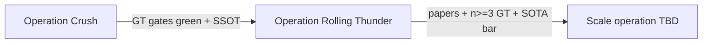

# Operation Rolling Thunder — proposed (post-Crush)

> **Status:** PROPOSED 2026-07-20. Do not start until Operation Crush exits:
> BB11+BB12 pass L0–L4 gates, pi write-back verified, one SSOT re-measurement on
> clean GT ([docs/operation_crush_assault_plan.md](operation_crush_assault_plan.md)
> Phase 3 complete). Prerequisite plan:
> [.cursor/plans/Zero-error GT axis capture](../.cursor/plans/) (GT substrate).

## The sequencing argument (why this operation exists)

Operation Crush fixes **data integrity** — without it, every alignment experiment,
paper number, and scale plan is unfalsifiable. Rolling Thunder is the **deliberate
pause to re-do science on clean ground** before betting on 20k–40k sets.

Wrong order (what cost a week): tune aligner → discover GT poison → re-litigate everything.

Right order:

1. **Crush** — GT + audio + axes correct (this plan + assault Phases 0–1).
2. **Rolling Thunder** — alignment SOTA push, experiment replay, audit product, papers.
3. **Next operation (TBD name)** — generalization to 20k–40k, synthetic at scale, new models.

Rolling Thunder is **not** corpus-wide ingest. It is n=2→n=3 GT sets, clean referees,
and internal research products that *earn* the scale plan.

---

## Operation map

| Operation | Job | Exit criterion |
|---|---|---|
| **Crush** (now) | De-poison GT, axes, audits, pi truth | BB11+BB12 L0–L4 pass; read-back exact |
| **Rolling Thunder** (next) | Aligner on clean data; replay ledger; audit UI; internal papers | Honest SSOT on 3 GT sets; EXPERIMENTS replayed or closed; audit product shippable |
| **Scale (future)** | 20k–40k sets, synthetic engine, fleet ops | Written plan only after RT exit; not started in RT |

---

## Rolling Thunder phases

### RT0 — Consolidation handoff (1–3 days)

- Merge Crush deliverables: gt-gate stack (#34/#37), branch consolidation (#48).
- Freeze referee: which timeline (`_lt`), which scorer flags — document once in SSOT.
- **Replay inventory:** list every open thread in [attic/EXPERIMENTS.md](../workspaces/alignment_prototype/attic/EXPERIMENTS.md) + open aligner issues (#2/#3/#4) as "re-run on clean GT" or "CLOSED — was poison."

### RT1 — Alignment algorithm on clean GT (2–4 weeks)

**Goal:** three-axis curves move on *certified* labels only ([alignment_recharacterization.md](alignment_recharacterization.md)).

- One canonical `make scorecard` + `make race` + per-axis strict+fiber on clean BB11/BB12.
- Re-run TRM diagnostics (#44) — first honest sim2real / flywheel numbers.
- Re-score failure tables for #2 (intro-grab), #3 (instance disambiguation), #4 (tempo_ratio) — close or reopen with evidence.
- Composed default target unchanged in intent: agentic placement + gated-ml decode; tune only what survives clean GT.
- E1 flywheel: only after AUTO pool is healthy (BB10 agentic with hubert+lyrics; vocal-enhance cache #46).
- **Kill rule:** no new sensors (sensor phase closed); actor + data engine only.

### RT2 — Research replay + audit product (3–6 weeks, overlaps RT1)

**Goal:** turn the spectrogram review stack into a **first-class audit product** (internal; potential external later).

Existing assets:
- [eda/alignment/spectrogram_review/](../eda/alignment/spectrogram_review/) — render/serve, truth boxes, ableton labels.
- [labeling/gt_review_ui.py](../labeling/gt_review_ui.py) — GT vs export diff.
- `make audit-gt`, gt-gate, L4 feature-resolvability (from Crush plan).

RT2 deliverables:
- **Audit session mode:** queue = spans where model guess matches ear but GT disagreed (Honest-class), plus axis-audit failures, plus L4 skips.
- **Verdict write-back:** human override → flagged export → re-gate (never bypass).
- **Fiber refresh:** re-run fiber validation on clean GT spans; update external validation doc if fiber-aware gap shifts materially (SALAMI precision floor unchanged in claim — re-measure recall on acappella).
- **Experiment replay checklist:** for each attic NO-GO/KILL, either re-run once on clean GT with dated result or mark "closed — precondition was poison."

### RT3 — Internal paper(s) (4–10 weeks, starts mid-RT1)

Not public submission yet — **internal rigor docs** that may split into multiple papers:

| Paper thread | Core claim | Depends on |
|---|---|---|
| **P1 — Decomposed eval** | Single-scalar alignment metrics lie; three axes + fiber-aware scoring | Clean GT + UnmixDB contrast (already framed) |
| **P2 — Fiber / instance** | Structure residual is real; fiber metric precision-validated | RT2 fiber re-measure |
| **P3 — Data integrity** | GT capture failure modes + gates (this repo's story) | Crush exit + audit product |
| **P4 — System** | Driver composition + abstention on real mixes | RT1 race board on clean GT |

Writing rule: numbers only from SSOT regeneration; each paper owns one claim; shared method section cites recharacterization doc.

### RT4 — Generalization plan (2–4 weeks planning only; execution = next operation)

**Do not execute corpus-wide work in Rolling Thunder.** Output is a **written scale plan** with cost/time models:

- **GT scale path:** BB10 hand-label (gated pipeline) → BB13 → … until LOSO n≥5 stable.
- **Pseudo-label path:** agentic AUTO_COMMIT at scale with acquisition gate (#41).
- **Synthetic path:** only where sim2real gap closed on clean referee (TRM flywheel or realism lever 1 revisited); axis-contrast stays KILLED until re-opened with new pre-registration.
- **20k–40k ingest:** depends on acquisition gate + `make check-inventory` as kernel preflight (architecture north star P4).
- **SoundCloud lake / mashup compiler / lab/** — north-north star; reference only in scale plan, not RT scope.

---

## Time estimates (honest ranges, one focused operator + agents)

Assumes Crush completes in **1–2 weeks** first.

| Phase | Calendar | Notes |
|---|---|---|
| Crush (prerequisite) | 1–2 weeks | Blocked on BB12 copy + path tier + gated re-export |
| RT0 handoff | 1–3 days | |
| RT1 aligner push | 2–4 weeks | Includes TRM re-run, race board, issue re-score |
| RT2 audit product | 3–6 weeks | Overlaps RT1; website hardening is parallelizable |
| RT3 internal papers | 4–10 weeks | Starts after RT1 has first clean headline; drafts overlap |
| RT4 scale *plan* only | 2–4 weeks | No 20k execution in RT |
| **Rolling Thunder total** | **~8–14 weeks** | To RT exit (3 GT sets + papers + audit product beta) |
| **Scale operation (future)** | **months–year** | 20k sets is fleet + ingest + labeling throughput problem |

Aug 1 north star: **Crush exit + RT1 started with honest SSOT** is achievable; full Rolling Thunder exit by Aug 1 is not — set milestone accordingly (e.g. Crush due Aug 1, Rolling Thunder due Oct 1).

---

## 2017 Mac (no GPU) — recommended role

**Do not use for:** TRM training, Demucs/MERT batch, gpubox jobs, `make race` full infer.

**Good use cases:**

| Task | Why it fits |
|---|---|
| **Ableton relink / repair** | `relink_als_after_tag.py`, `fill_als_clip_tags.py` — fix deactivated/offline clips after audio moves |
| **Human labeling + audit UI** | Run spectrogram review server + gt_review_ui locally; low GPU need |
| **gt-gate / export / dry-run** | `export_als_to_gt`, `make gt-gate`, anchor_check — CPU-only |
| **Batch audit queue drain** | L2/L3 audits on exported yaml; export review ledgers |
| **Second-machine safety** | Mirror `~/aligning/` read-only copy for experiments without touching primary Mac's live sessions |

**Your deactivated Ableton sessions:** classic offline-clip problem after moving audio. Rolling Thunder should include a **"legacy session repair"** workstream on the 2017 Mac:

1. Inventory `.als` + list offline/missing paths (`diagnose_manifest_als_paths` pattern).
2. Relink to current audio locations (copy-only; backup `.als` first).
3. Open in Live to confirm samples resolve (human gate).
4. Only then consider whether any session becomes a GT candidate — **same L0–L4 gates as BB11/BB12**, no shortcut.

Potential value: extra hand-labeled sets beyond BB if sessions are repairable; not a substitute for BB10/BB13 pull from pi.

---

## GitHub tracking (when Crush closes)

Create milestone **Operation Rolling Thunder** with issues roughly:

- RT1: clean-GT scorecard + race + TRM re-run (#44 successor)
- RT2: audit product hardening (spectrogram review + verdict write-back)
- RT2: EXPERIMENTS replay checklist
- RT2: fiber re-validation on clean GT
- RT3: internal paper P1 (decomposed eval) — doc issue only until RT1 numbers exist
- RT4: 20k–40k scale plan doc (output of RT, not execution)
- Infra: 2017 Mac relink playbook + legacy session inventory

Update [Operation Crush #43](https://github.com/jca225/tracklist_engine/issues/43) digest to point at Rolling Thunder as the next milestone when Crush closes.

---

## Relation to other docs

- **Crush:** [operation_crush_assault_plan.md](operation_crush_assault_plan.md) — data integrity, Phases 0–3.
- **This plan (GT substrate):** `.cursor/plans/Zero-error GT axis capture` — Phases 1–5 execution.
- **Architecture:** [architecture_north_star.md](architecture_north_star.md) — OS map; page cache + P4 data engine land in scale op.
- **Lab:** [lab/CLAUDE.md](../lab/CLAUDE.md) — reactivates after RT proves alignment + n≥3 GT.
- **Tesla data engine frame:** [tracklist_data_engine_plan.md](tracklist_data_engine_plan.md), [kernel_data_engine_plan.md](kernel_data_engine_plan.md) W4–W5, [acquisition-data-engine-design](superpowers/specs/2026-07-18-acquisition-data-engine-design.md).

---

## Tesla data engine analogy — still holds (2026-07-20 audit)

The three-operation sequence **is** the Tesla/Waymo loop with the skipped step made explicit:

| Tesla / Waymo concept | Our operation | What it is here |
|---|---|---|
| **Sensor calibration + ground truth integrity** | **Operation Crush** | Pantry + answer key: `track_audio_id`, full axes, Ableton ↔ DB ↔ yaml agree. *Cannot mine failures or pseudo-label on poisoned labels — miscalibrated sensors.* |
| **Shadow mode + re-benchmark** | **Operation Rolling Thunder** | Re-run EXPERIMENTS on clean GT; audit UI for human disagreement review; fiber/TRM oracle replays after calibration. |
| **Fleet deployment + trigger mining** | **Scale op (TBD)** | W5 at 20k: abstention triggers, driver disagreement, pseudo-label pool, active labeling queue ([kernel_data_engine_plan.md](kernel_data_engine_plan.md) W5). |

**Two data engines (do not conflate)** — per [alignment_learning_plan_review.md](alignment_learning_plan_review.md):

1. **Acquisition engine** (pantry): residual → worklist → acquire → gate 1 (matchable) → gate 2 (scorer verified). Crush + RT2 audit product.
2. **Learning flywheel** (chef): AUTO_COMMIT pseudo-labels → tiered training → re-race. Only after L0–L4 + calibration exists. E1 noise floor on thin/poisoned pools = FixMatch discipline working as designed.

**Kitchen metaphor** ([tracklist_data_engine_plan.md](tracklist_data_engine_plan.md)): Phase 0 pantry → **Crush**; Phase 2 trained chef → **RT1**; Phase 3 kitchen loop → **RT flywheel + Scale W5** (not before chef beats hand-tuned stack on clean referee).

**Waymo split unchanged:** online kernel = `make align`; offboard labeler = agentic + audit tiers; John = worst-first queue minutes/day (RT2), not whole-set relabeling. 2017 Mac = second review/relink station.

**Aug 1 reframe:** kernel plan assumed pantry was clean enough to spin W5. Crush corrects that. Aug 1 = **calibrated sensors + shadow re-benchmark started**, not full fleet loop.
