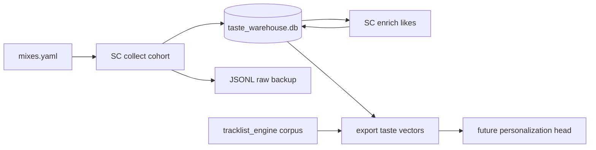

# Taste prior — subjective listener experience (IN PROGRESS)

**Status:** Phase 1 scaffold — SoundCloud cohort + likes on **pi-worker**.  
**Home:** [personalization/](../personalization/)  
**Sibling:** [aligner_attention_design.md](aligner_attention_design.md) (structure probe),
[eda/corpus_empirics/findings.md](../eda/corpus_empirics/findings.md) §7 (user-history is
per-user, not aggregate).

## Problem

The aligner and structure probe ask **what happened in the mix** (objective). A
generative / experiential model asks **would this observer like it?** — that requires a
**subjective prior** built from listener history (your “child in another generation”
thought experiment).

Aggregate chart signals (Billboard, Last.fm track listeners) plateau at ~R² 0.44 for set
views. Per-user taste lives in **SoundCloud likes + playlists** (timestamped preference
timeline), not in the canonical `music_database.db`.

## Lineage (assimilated from Desktop Archive)

Salvaged from `Archive/music web scraping/dj-listener-pipeline/` (April 2026):

| Kept | Discarded |
|------|-----------|
| SC `client_id` extraction + api-v2 collect | Demographic ML (location/gender/wealth) |
| Likers / reposters / commenters on mix upload | Reddit / PRAW |
| Per-user `track_likes` enrich (`liked_at`) | PyMC hierarchical, graph/Leiden |
| Mix comments (`commented_at` + `mix_position_ms` playhead) | Demographic ML |
| Checkpoint + JSONL + rate limits | DuckDB (→ SQLite warehouse here) |

BB11 archive already has **~21k SC listeners** and **~831k likes** on disk — import path
provided so pi-worker does not re-scrape from zero.

## Architecture



| Layer | Runs on | Storage |
|-------|---------|---------|
| SC scrape loop | **pi-worker** | `data/taste/` + `data/taste/taste_warehouse.db` |
| Canonical corpus | pi-storage | `music_database.db` (unchanged) |
| Taste export / join | Mac or pi-storage | `data/analysis/taste_export/` |

**Not in canonical DB** until the signal is proven — same rule as `aux.db`.

## Mix comments (engagement timesteps)

SoundCloud comments on a mix upload carry **two timestamps**:

| Field | Meaning | Use |
|-------|---------|-----|
| `commented_at` | Wall-clock when they posted | Cohort activity, recency |
| `mix_position_ms` | Playhead in the mix (`timestamp` in SC API) | **Primary alignment signal** — “Dayum” at 58:52 overlays GT / MIR peaks |

Stored in `sc_mix_comments`; collected live via `collect` and imported from Archive
`soundcloud_comments/*.jsonl`. P2 joins comment density vs structure-probe boundaries
as weak engagement labels for fine-tune.

## Phases

### P1 — Cohort + likes + comments (this PR)

- [x] `personalization/` module (config, SC client, collect, enrich, SQLite)
- [x] `mixes.yaml` for `1fsnxchk` (BB12) + `2nvzlh2k` (BB11)
- [x] `main loop` CLI + systemd unit for pi-worker
- [x] `import-archive` from dj-listener-pipeline JSONL (listeners, likes, **comments**)
- [ ] Deploy to pi-worker, import BB11 archive, resume enrich
- [ ] Status dashboard query (`main status`)

### P2 — Join to corpus

- Match SC like titles → `recording` / `work` (fuzzy + chart aux)
- Build per-user sparse taste vector over corpus recordings
- **Comment heatmap per mix** — aggregate `mix_position_ms` vs MIR/GT peaks
- Export for personalization + **engagement fine-tune** (comment timestep as weak label)

### P3 — Personalization head (future repo or promote)

- Prior + history blend (pattern from `predicting hangy` relief recommender)
- Condition mashup compatibility on user taste vector
- OAuth SoundCloud/Spotify for production (not scrape)

## pi-worker ops

```bash
# Mac — deploy + install unit (once)
make deploy-worker
make install-taste-scrape   # copies systemd unit, enables timer

# Manual
ssh pi-worker 'cd ~/tracklist_engine && venvs/web_crawler/bin/python -m personalization.main status'
ssh pi-worker 'cd ~/tracklist_engine && venvs/web_crawler/bin/python -m personalization.main loop --once'

make logs-taste-scrape
```

Env: `TASTE_DATA_DIR` (default `data/taste`), `TASTE_SC_RPM` (default 45).

## Ethics

- Public SC endpoints only; hashed `user_id` in exports
- Research / local warehouse — not shipped externally
- Respect rate limits; resumable checkpoints
- Production path = OAuth, not scrape
